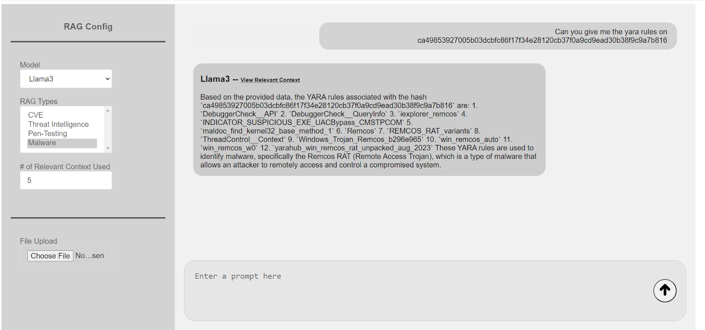

<h1 align="center"> Malware Analysis RAG </h1>

  

## Overview

This project implements a Retrieval-Augmented Generation (RAG) model designed to answer user queries based on the malware information and hash numbers provided in reports or questions. By utilizing Meta's LLaMA 3 and retrieving accurate hash descriptions, the system ensures that the language model has the relevant data to effectively respond to user inquiries.

Learn more about how to use our Malware Analysis Rag from our [document](assets/Developing_a_RAG_To_Mitigate_LLM_Hallucinations_in_Malware_Data.pdf).

For a more interactive learning experience, check out our YouTube video
[**How to Use Our Malware Analysis Rag**](https://youtu.be/8v7BxJ0Glio?si=tkFuZnWctCKI3Io6).

## Examples

#

  

